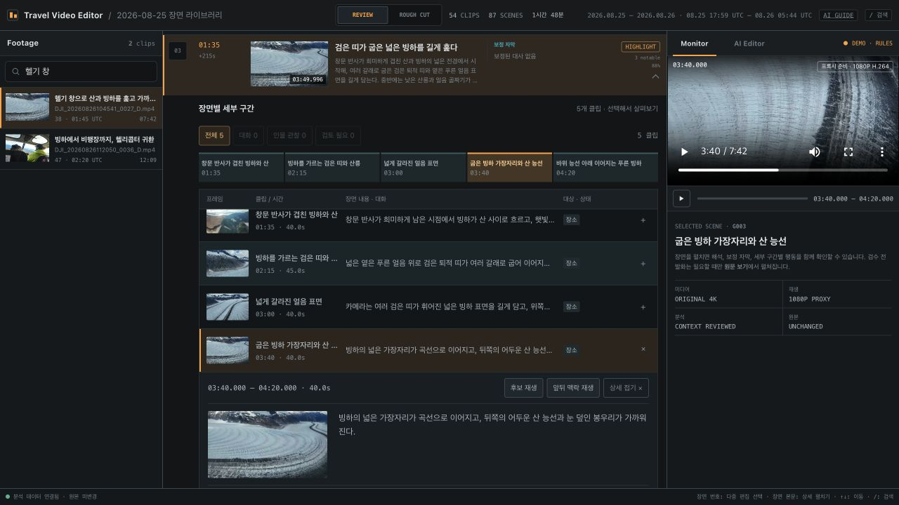
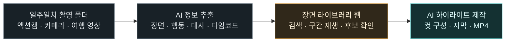
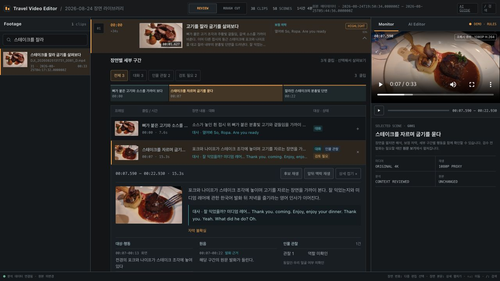
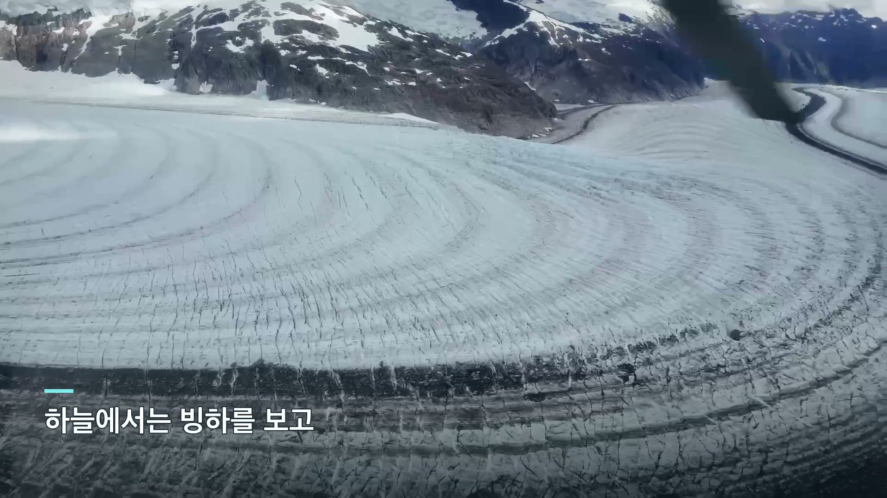

<div align="center">

# Travel Video Editor

### 일주일치 여행 영상에서, 다시 보고 싶은 한 편까지.

촬영 폴더를 **장면·대사가 담긴 웹 라이브러리**로 정리하고,<br>마음에 드는 순간을 골라 **AI와 하이라이트 영상**을 만드세요.

**Claude Code · Codex** &nbsp; / &nbsp; **로컬 미디어** &nbsp; / &nbsp; **원본 보존**

[어떤 결과를 얻나요?](#어떤-결과를-얻나요) · [AI에게 맡기기](#ai에게-이렇게-요청하세요) · [시작하기](#시작하기)

</div>



> “빙하가 처음 보이는 순간, 스테이크를 자르며 나눈 대화, 열차 창밖으로 펼쳐진 계곡.”<br>
> 파일명으로는 찾기 어려웠던 여행의 순간을 **내용으로 찾고, 구간으로 고르고, 영상으로 남깁니다.**



## 어떤 결과를 얻나요?

| 입력 | 만들어지는 것 | 할 수 있는 일 |
|---|---|---|
| 날짜별로 쌓인 수십·수백 개 영상 | **영상별 요약과 시간순 라이브러리** | 어느 날 어디서 무엇을 찍었는지 빠르게 훑기 |
| 길게 이어진 하나의 촬영 파일 | **의미 단위 장면과 세부 클립** | 풍경이 열리는 순간, 행동의 시작과 끝, 대화의 흐름 찾기 |
| 한국어·영어가 섞인 여행 대화 | **원문 대사·자막·발화 타임코드** | “이때 무슨 말을 했지?”를 장면과 함께 확인하기 |
| 장면 설명·대표 프레임·편집 근거 | **검색·재생 가능한 웹과 후보 JSON** | 원하는 구간만 보고 하이라이트 후보 고르기 |
| 선택한 후보와 원하는 분위기 | **하이라이트 MP4·SRT·편집 계획** | 짧은 풍경 모음, 음식 편집, 하루 기록, 여행 전체 요약 만들기 |

분석 결과는 한 번 쓰고 버리는 요약이 아닙니다. 같은 라이브러리에서 **풍경 중심 60초 영상**, **대화를 살린 음식 편집**, **여행 전체를 담은 긴 기록물**을 다시 구성할 수 있습니다.

### 01 / 촬영 파일을 편집 가능한 장면으로

AI가 화면·행동·대화를 함께 읽어 장면을 나누고, 그 안에서 살릴 만한 더 작은 구간을 추출합니다. 각 구간에는 제목, 구체적인 설명, 대표 프레임, 시작·끝 시간, 등장 대상과 편집에 필요한 근거가 연결됩니다.

예를 들어 헬리콥터 비행 한 파일도 **산등성이 → 눈밭 → 넓은 빙하 → 가까운 얼음 표면**으로 찾아볼 수 있습니다. 말이 없는 풍경도 독립된 클립 후보로 남습니다.

장면 분할은 원본을 수백 개 파일로 복제하는 대신 **원본 파일 + 시작·끝 타임코드**로 저장합니다. 실제 영상 조립은 선택한 구간을 렌더할 때 이루어집니다.

### 02 / 장면과 대사를 한 화면에서



**“무슨 장면인지”와 “무슨 말을 했는지”를 함께 확인합니다.**

- 제목·설명·대사로 촬영분을 찾고, 대표 프레임으로 빠르게 훑습니다.
- 클립을 펼치면 장면 내용, 원문 대사, 행동과 시간 범위를 함께 볼 수 있습니다.
- 후보 구간만 재생하거나 앞뒤 맥락을 이어 보며, 대화가 잘리지 않는지 확인합니다.
- 불확실한 발화와 검토가 필요한 정보도 표시해 편집 판단에 활용합니다.

스크린샷은 실제 여행 영상의 분석 결과입니다. 소개용 이미지에는 얼굴이 보이지 않는 장면을 골랐습니다. `DEMO · RULES`는 캡처 서버의 채팅 모드이며, 표시된 장면·대사 데이터는 기존 실제 추출 결과입니다.

### 03 / 원하는 이야기를 말하면, AI가 영상으로

> “빙하와 열차 풍경을 중심으로 90초짜리 하이라이트를 만들어줘.<br>
> 우리 얼굴이 보이는 구간은 빼고, 음식 장면을 중간에 넣어줘.<br>
> 풍경은 조금 여유 있게, 대사는 문장이 끝나는 곳까지 살려줘.”

Claude Code나 Codex가 장면 후보를 조사하고, 순서·길이·선택 이유를 담은 편집 계획을 만듭니다. [video-editor 스킬](skills/video-editor/SKILL.md)이 그 계획을 실행해 구간을 자르고, 재배열하고, 제목·자막을 얹어 실제 MP4로 조립합니다. 프록시로 미리 본 뒤 같은 타임코드를 원본에 연결해 최종 렌더할 수 있습니다.



*실제 편집 사례: 136컷을 담은 17분 59초 여행 하이라이트의 오프닝. 위 이미지는 완성 MP4에서 캡처했습니다.*

함께 남는 결과물은 **재생할 MP4**, **자막 SRT**, **다시 수정할 편집 계획 JSON**, **어떤 원본 구간을 사용했는지 기록한 렌더 manifest**입니다. 장면 순서나 길이를 바꾸고 싶을 때도 이 계획에서 이어갑니다.

## AI에게 이렇게 요청하세요

이 저장소를 Claude Code 또는 Codex에서 열고 아래 요청을 붙여 넣으면 됩니다. 경로와 날짜, 원하는 결과만 바꾸세요.

**처음 촬영분을 정리할 때**

```text
skills/travel-video-pipeline/SKILL.md와
docs/reusable-scene-library-runbook.md를 읽고 진행해줘.

이 폴더의 일주일치 여행 영상을 날짜별로 정리해줘: /path/to/trip
원본은 보존하고 프록시로 처리해.
의미 단위 장면, 구체적인 행동·볼거리, 한국어·영어 대사를 추출하고
영상별 요약, 클립 후보 JSON, 검색·재생 가능한 웹 라이브러리까지 만들어줘.
독립된 날짜와 장면은 병렬 처리하고, 완료한 분석은 재사용해줘.
```

**완성 영상을 만들 때**

```text
skills/video-editor/SKILL.md를 읽고, 이 라이브러리의 후보로 편집해줘.

빙하·열차·먹거리를 담은 3분 여행 하이라이트를 만들어줘.
우리 얼굴이 보이는 컷은 제외하고, 대화는 맥락이 끊기지 않게 살려줘.
장면의 순서와 선택 이유를 보여준 뒤 프록시 미리보기를 렌더해줘.
MP4, 자막 SRT, 재현 가능한 편집 계획을 함께 남겨줘.
```

**수정할 때**

```text
오프닝은 빙하가 가장 잘 보이는 컷으로 바꿔줘.
열차 풍경은 조금 길게, 반복되는 이동 장면은 줄여줘.
음식 장면의 질문과 대답은 함께 남기고 이전 편집안도 보존해줘.
```

얼굴 제외처럼 중요한 조건은 선택된 실제 컷을 확인하며 적용합니다. 장면의 익명 인물 관찰 정보만으로 동일인이나 얼굴 부재를 확정하지 않습니다.

## 두 스킬이 이어서 일합니다

| 스킬 | 역할 | 주요 결과 |
|---|---|---|
| [travel-video-pipeline](skills/travel-video-pipeline/SKILL.md) | 촬영분에서 시각·음성 근거를 만들고 장면과 대사를 구조화 | 요약, 타임라인, 장면 웹, 후보 JSON |
| [video-editor](skills/video-editor/SKILL.md) | 후보와 편집 의도를 실제 영상으로 조립 | MP4, SRT, 편집 계획, 렌더 기록 |

스킬 원본과 실행 스크립트가 저장소에 함께 들어 있습니다. 에이전트에게 해당 `SKILL.md`를 읽도록 요청하면 작업 절차와 입출력 계약을 공유할 수 있습니다.

`video-editor`는 여러 파일의 구간 연결, 순서 변경, 0.25–8배속, 오디오 gain/mute/fade, 가로·세로 리프레임, 회전, 전환, 제목·번인 자막과 원본 재연결을 지원합니다. 웹의 **AI Editor 채팅은 현재 Codex SDK 기반**이며, Claude Code는 터미널에서 스킬·CLI를 사용하는 경로입니다.

## 첫 사용은 온보딩부터

스킬을 처음 호출하면 **영상 현황을 가볍게 확인 → 맥락에 맞춰 작업 범위 질문 → 필요한 환경 점검·설치 → 편집 방향 선택**을 함께 진행합니다. 파일 수·길이·날짜 분포와 기존 분석 자료부터 살펴보며, 위치를 모르면 그것만 먼저 묻습니다. Apple 음성 모델은 실제 설치 상태를 확인하고, 기존 분석 자료로 편집할 때는 불필요한 음성 모델 설치를 건너뜁니다.

> 이 폴더에 영상과 기존 분석 자료가 얼마나 있는지 먼저 쓱 살펴봐줘.
> 그걸 보고 장면 추출만 할지 하이라이트까지 만들지 같이 정하고, 필요한 설치도 도와줘.

장면 추출만 원하면 영상 스타일 설문 없이 웹·후보 생성까지 진행합니다. 영상을 만들려면 목적, 길이, 가로·세로, 대사·자막·음악과 제외 조건을 짧게 나눠 묻습니다. 다음 사용부터는 저장된 설정을 재사용합니다. [첫 사용 가이드](docs/onboarding.md)

## 시작하기

Python 3.11+, FFmpeg·ffprobe, `uv`, Claude Code 또는 Codex를 준비합니다. 기본 로컬 음성 처리 경로는 **Apple Silicon/macOS 중심**이며, Apple STT 경로는 macOS 26 이상이 필요합니다. 사용하는 LLM의 인증과 이용 한도는 별도로 준비합니다.

```bash
git clone https://github.com/kys42/travel-video-editor.git
cd travel-video-editor
uv sync --group dev
```

먼저 짧은 영상이나 하루치로 시작한 뒤 범위를 늘리세요. 여러 날의 준비·추출·요약·웹 생성은 [장면 라이브러리 실행 가이드](docs/reusable-scene-library-runbook.md)를 따릅니다.

**만들어진 라이브러리 열기**

```bash
uv run travel-video serve-editor \
  /path/to/library/manifest.json \
  --state-dir work/editor-state \
  --agent-backend codex \
  --host 127.0.0.1 --port 8765
```

브라우저에서 `http://127.0.0.1:8765`를 엽니다. 분석이 끝난 라이브러리를 모델 호출 없이 살펴보려면 `--agent-backend demo`를 사용할 수 있습니다.

**편집 계획에서 영상 렌더하기**

```bash
uv run python skills/video-editor/scripts/render_edit.py \
  /path/to/highlight.edit-plan.json \
  --output /path/to/highlight.mp4 \
  --media-mode auto
```

최종본을 원본에서 렌더하려면 원본 연결을 확인하고 `--media-mode source`를 사용합니다. 원본 해상도에 따라 UHD 출력에 스케일링이 포함될 수 있습니다.

## 실제로 사용한 규모

시애틀·알래스카 여행 **9일치 376개 영상**에서 **1,745개 클립 후보**를 추출하고 날짜별 장면 라이브러리를 만들었습니다. 별도 편집 작업으로는 **136컷·17분 59초 하이라이트**와 원본에 재연결한 UHD 결과물을 제작했습니다.

이 숫자는 실제 작업 사례이며, 처리 시간·비용이나 모든 영상에서의 품질을 보장하는 벤치마크는 아닙니다. 대사와 의미 판단에는 불확실성이 남을 수 있습니다.

## 원본은 보존하고, 편집은 다시 만들 수 있게

- 원본 영상은 읽기 전용으로 보존합니다. 큰 프록시·렌더 파일은 외장 작업 저장소에 둘 수 있습니다.
- 장면과 컷은 원본 상대 경로·타임코드와 연결됩니다. 결과를 보고 선택 이유와 원본 구간을 거슬러 올라갈 수 있습니다.
- 프록시·음성·프레임 캐시를 재사용하고, 검증 후 병합해 같은 분석을 불필요하게 반복하지 않습니다.
- 로컬 도구가 전처리와 렌더를 맡습니다. LLM 분석에 필요한 텍스트·이미지는 사용하는 모델 서비스로 전달될 수 있습니다.

## 더 알아보기

| 관심 있는 내용 | 문서 |
|---|---|
| 다음 여행을 처리하는 전체 절차 | [장면 라이브러리 실행 가이드](docs/reusable-scene-library-runbook.md) |
| 장면·대사·클립에 담기는 정보 | [편집용 정보 추출 계약](docs/clip-editorial-evidence.md) |
| 원본 → 편집 근거 → 하이라이트 | [Golden 01](docs/golden/01-raw-to-editorial-evidence.md) · [Golden 02](docs/golden/02-editorial-evidence-to-highlight.md) |
| AI 편집과 로컬 웹의 기능 | [AI Editor 가이드](docs/technical/agent-capabilities.md) |
| 영상 편집 계획과 렌더 옵션 | [video-editor](skills/video-editor/SKILL.md) · [편집 계획 규격](skills/video-editor/references/edit-plan.md) |
| 저장소·프록시·원본 연결 | [미디어 위치](docs/media-locations.md) |
| 상세 CLI 예시와 초기 개발 기록 | [이전 README 아카이브](docs/archive/README-2026-09-08.md) |

<sub>소개 이미지: 직접 촬영한 여행 영상과 실제 로컬 웹 화면. 전체 원본·개인 라이브러리·완성 영상은 저장소에 포함하지 않습니다.</sub>
